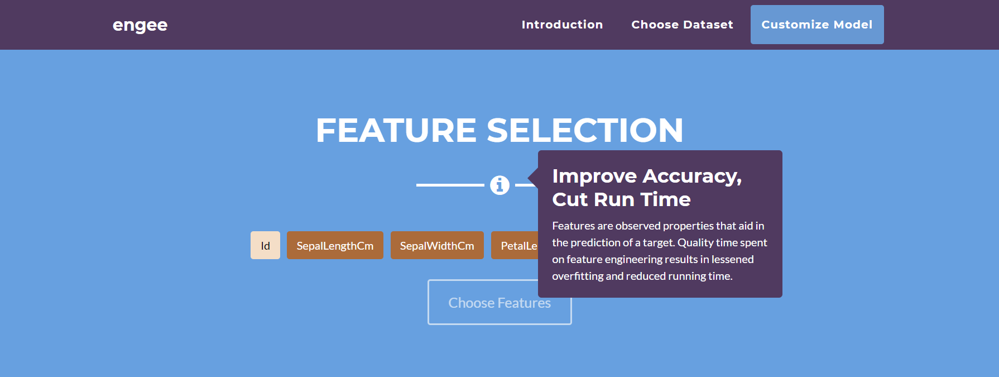
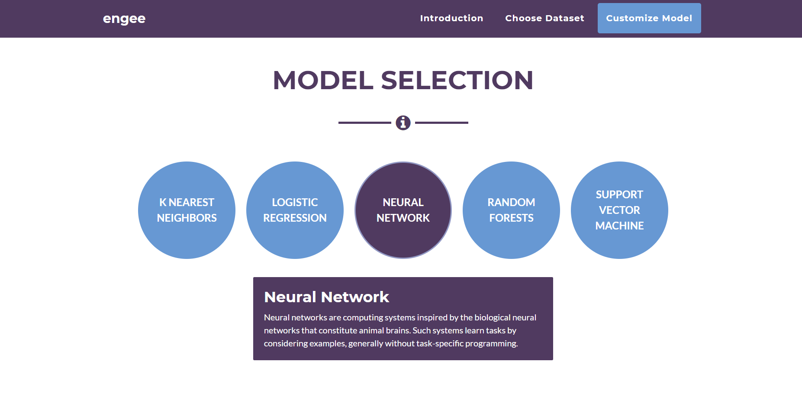

# Engee

engee is designed to educate data enthusiasts and empower non-technical analysts. With an easy-to-use interface and guided tooltips, engee makes machine learning a breeze to learn and implement. So import your dataset, and dive into the machine learning pipeline now!

# Dependencies
* Node.js
* Flask
* NumPy
* Pandas
* Sci-Kit Learn
* Matplotlib
* Seaborn

# Startup
1. run start.bat to activate the flask server on a local host
2. navigate to views/website/index.html to launch the web application

# Screenshots
Feature Selection Screen

Model Selection Screen

