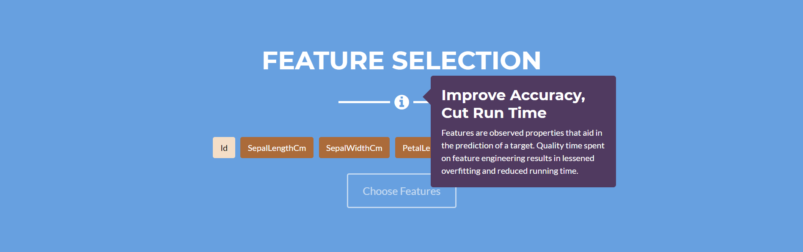

# Engee

Engee is a web application designed to educate data enthusiasts and empower non-technical analysts. With an easy-to-use interface supported by guided tool-tips, Engee makes machine learning a breeze to learn and implement. In just a few clicks, users can go from importing a dataset to analyzing the confusion matrix of their selected model.

# Dependencies
* Node.js
* Flask
* NumPy
* Pandas
* Sci-Kit Learn
* Matplotlib
* Seaborn

# Startup
1. run start.bat to activate the flask server on a local host
2. navigate to views/website/index.html to launch the web application

# UI Screenshot

