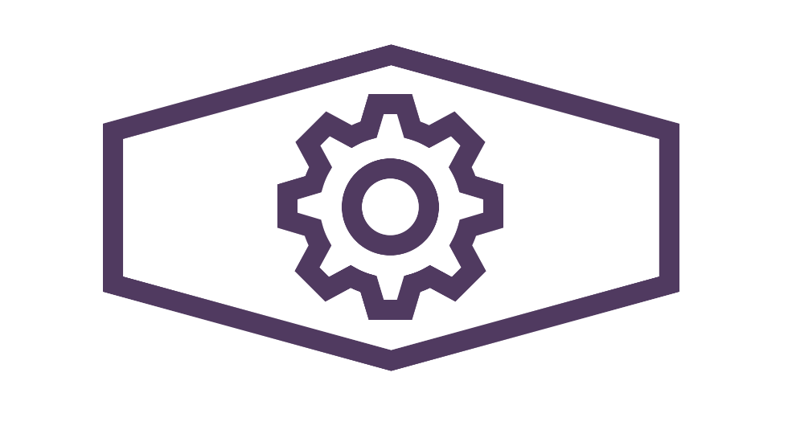

# engee
under construction...

# Dependencies
* Bootstrap
* Flask
* Node.js
* NumPy
* Pandas
* Sci-Kit Learn
* Matplotlib

# Startup
1. run start.bat to activate the flask server on localhost:5000
2. navigate to views/website/index.html to launch the web application
